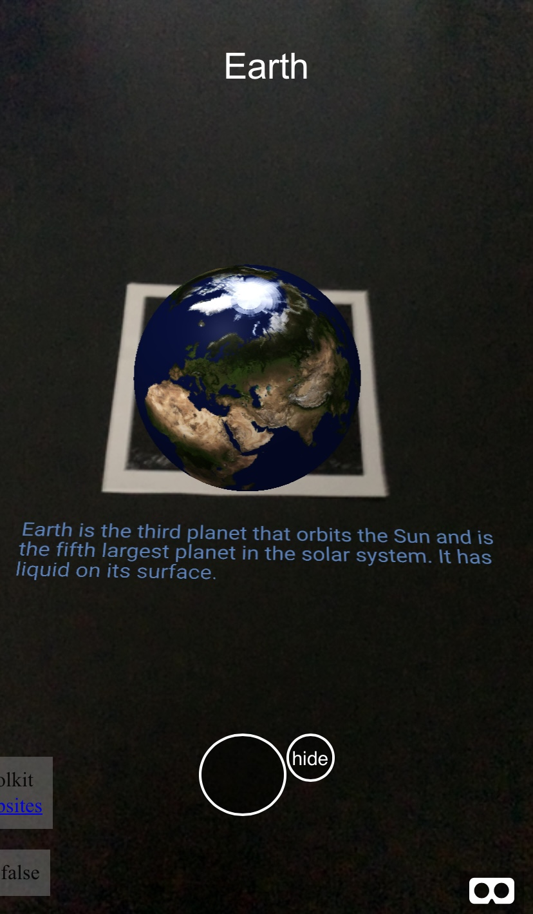
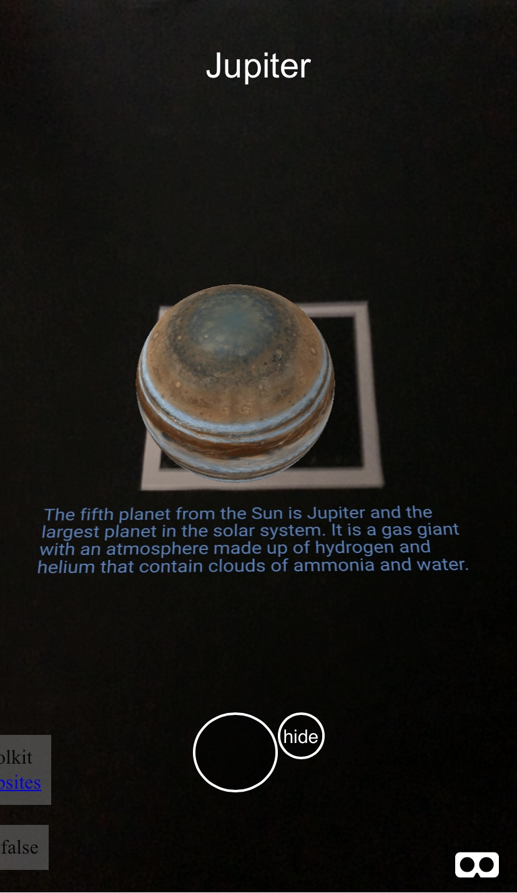
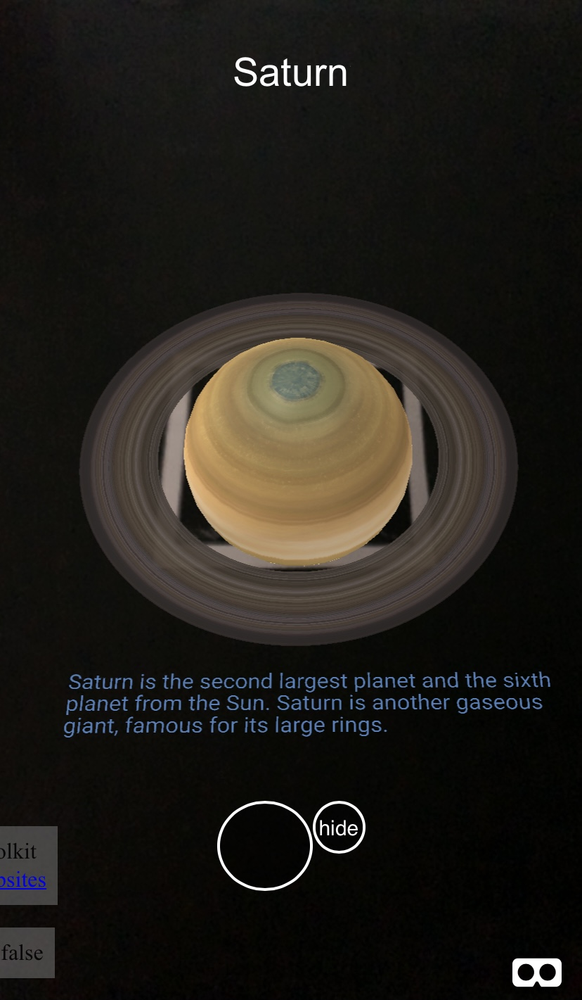

# Solar System AR Website 

Learn about the planets in our Solar System in an AR environment! 

### Before visiting
You will need the AR marker to display the AR content. Use this reference image to download and print the marker.

<a href="website/assets/markers/pattern-marker.png" download>click here for a direct download</a>

### While on the site 
Aim your camera to the marker and use the large button located on the bottom of the screen to swap between the planets. Each planet has a short description, which you can hide by pressing the hide button. If you are on a laptop or PC with an external camera, face the marker towards the camera and use your mouse to interact with the buttons.

## You are now ready to explore The Solar System in AR
- Visit the AR page [here](website/ar-index.html)

 

#### What you'll see 

  
  
  
  

